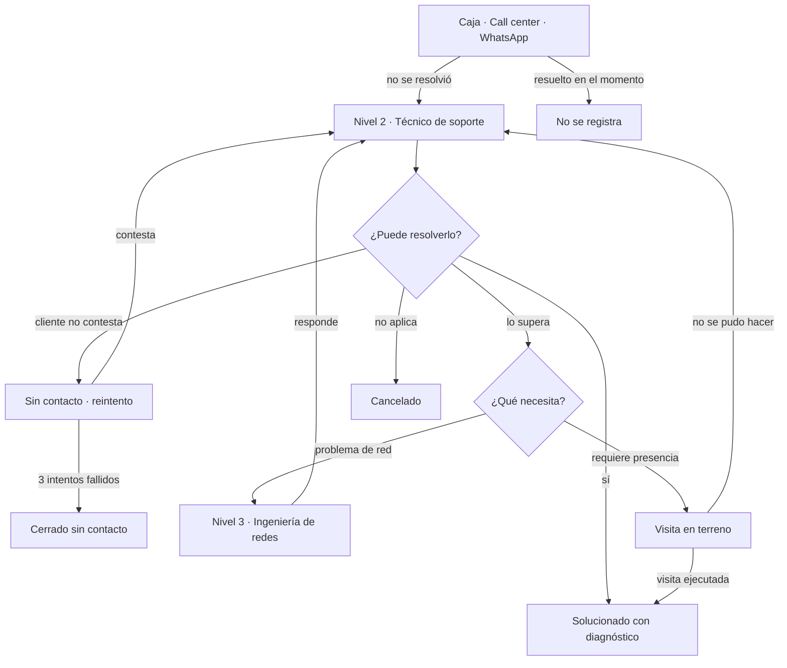

# Sistema de Gestión Técnica

Sistema de control operativo para la mesa de soporte de un proveedor de internet y TV
por fibra. Laravel 13 · Livewire 3 (Volt) · MySQL · Tailwind.

---

## Por qué existe

La operación en la que se basa este proyecto ya tiene un ERP —SAE Plus— para facturación,
contratos, cortes y reconexiones. Y aun así el equipo de soporte lleva **un Excel al lado**,
con más de 5.000 casos en un semestre.

Ese Excel es la evidencia del hueco: el ERP administra el negocio, pero nadie controla el
turno. En ese archivo no se puede saber si un caso lleva dos horas o dos días sin tocar; el
12% de los casos queda en "sin contacto" y nadie los vuelve a llamar; y el diagnóstico
técnico —el dato que explica *por qué* se cae el servicio— solo sirve si alguien se sienta a
contar filas a mano.

> **Este sistema no reemplaza el ERP del ISP. Reemplaza el Excel que llevan al lado.**

De ahí sale la frontera del alcance:

| Adentro | Afuera |
|---|---|
| Ciclo de vida del caso | Facturación y recaudo |
| Tiempos y cumplimiento de SLA | Cortes y reconexiones |
| Responsables y escalamiento | PQRS formales |
| Diagnóstico y analítica de fallas | El plan del cliente como fuente de verdad |
| Visitas, evidencia e inventario consumido | Integración con Mikrotik / OLT |

Un cambio de plan aquí es una **solicitud con seguimiento** —quién la pidió, quién la
ejecutó, cuánto se demoró—, no la ejecución del cambio.

---

## El flujo real

Un cliente se queja por uno de tres canales: **caja** (presencial), **call center** o el
**WhatsApp de soporte**. Si el primer nivel lo resuelve ahí mismo, no se registra nada. Solo
sube al sistema lo que ese primer contacto no pudo cerrar.



Los 5.058 casos del histórico son, entonces, **los fracasos de resolución de primer nivel**,
no el volumen total de quejas.

---

## Roles

Los nombres siguen el flujo real, no los del Excel original —donde la columna "INGENIERO"
en realidad contenía a los técnicos de soporte.

| Rol | Qué hace |
|---|---|
| `call_center` | Primer nivel: caja, teléfono y WhatsApp. Registra los casos que no pudo cerrar. |
| `tecnico_soporte` | Nivel 2, remoto. Es el dueño del reloj de SLA. |
| `ingeniero_redes` | Nivel 3. Recibe los casos escalados y los devuelve con respuesta. |
| `tecnico_campo` | Ejecuta las visitas. Solo ve las suyas. |
| `gerente` | Consulta el panel y toda la operación. |
| `admin` | Todo, incluida la administración de usuarios. |

---

## Reglas de negocio

Estas reglas viven en el **modelo**, no en los formularios. Cualquier pantalla, comando o
job que mueva un caso pasa por ellas.

### Máquina de estados

`App\Models\Soporte::TRANSICIONES` define qué movimientos son válidos desde cada estado.
Un salto inválido lanza `TransicionInvalidaException`; la interfaz dibuja sus botones a
partir del mismo mapa, así que nunca ofrece algo imposible.

Estados: `pendiente`, `en_proceso`, `seguimiento`, `sin_contacto`, `enviado_tecnico`,
`escalado_n3`, `solucionado`, `cancelado`, `cerrado_sin_contacto`.

Ningún caso se cierra sin diagnóstico, y ninguno se cierra mientras tenga una visita abierta.

### Criticidad derivada

La criticidad **no la escoge el asesor**. El criterio de la operación es: si el servicio
está caído se atiende de inmediato, el resto va a cinco días hábiles. Eso se calcula:

- `tipo_solicitud = sin_internet` → **inmediata**
- falla marcada como `critica` en `tipos_falla` (sin señal de TV, fallas con la TV) → **inmediata**
- cambio de plan o de titular → **normal**
- resto → **normal**

Se puede elevar a mano, pero exige motivo y queda registrado en el historial.

### Los tres relojes

El reloj del nivel 2 corre **solo en horario hábil** y **se detiene** cuando el caso deja de
depender de él:

- visita programada → pausa
- escalado a redes → pausa
- esperando que el cliente conteste → pausa

Al volver, se reanuda con los minutos que quedaban. Las otras dos ventanas —cumplimiento de
la visita y tiempo de respuesta de redes— se miden aparte.

`App\Support\CalendarioHabil` cuenta ese tiempo respetando la jornada, los fines de semana y
los **18 festivos de Colombia**, que se calculan y no se listan: seis fijos, siete corridos
al lunes por la Ley 51 de 1983 (Emiliani) y cinco dependientes de la Pascua, con el algoritmo
de Meeus/Jones/Butcher.

### Sin contacto con política

Cada intento se cuenta y programa el siguiente a cuatro horas hábiles. Al tercero, el caso se
cierra como `cerrado_sin_contacto` con constancia —en vez de quedar flotando, que es lo que
pasaba en el Excel con 364 casos del semestre.

Quien cierra el círculo es el comando `soportes:reintentar-contacto`, que corre cada cuarto de
hora: devuelve a la cola del nivel 2 los casos cuyo reintento ya venció —reanudando el reloj— y
cierra los que agotaron los intentos. Sin él la hora de reintento pasaría y nadie volvería a
llamar, que es justamente el problema que se quería resolver. Esas transiciones quedan marcadas
en el historial como automáticas, sin usuario.

### El técnico en terreno

La visita es el único punto del flujo donde el sistema no está: el técnico está
en un sótano, en una zona rural o en un edificio con paredes gruesas, y el cliente
está delante esperando para firmar. Si cerrar la visita exige señal, el técnico lo
apunta en un papel y lo pasa por la noche —o no lo pasa—, que es el mismo agujero
que este proyecto existe para tapar.

Por eso `/campo` es una pantalla aparte de `/ordenes`, con su propio layout: se usa
de pie, con una mano y a veces con guantes. La ruta del día, un toque para llamar,
otro para abrir el mapa, y el cierre con diagnóstico, trabajo realizado, material
consumido, hasta seis fotos y la firma del cliente en el lienzo.

**El cierre nunca depende de la red.** Se guarda en el teléfono (IndexedDB) y se
envía solo cuando vuelve la señal. Tres decisiones sostienen eso:

- **El identificador del cierre lo pone el teléfono**, antes de enviar. Un reenvío
  después de una sincronización a medias trae el mismo `uuid`, el servidor lo
  reconoce y responde que sí sin cerrar el caso dos veces ni descontar el material
  dos veces. Sin esto, la cola sería peor que el papel.
- **La hora que manda es la del terreno**, no la de la sincronización: si cerró a
  las 10:05 sin señal y sincronizó a las 14:30, la visita terminó a las 10:05. Se
  descarta si es imposible —un reloj de celular mal puesto no fecha una visita el
  mes que viene—.
- **Un fallo que se arregla reintentando no es lo mismo que uno que no.** Un 5xx o
  una red caída se reintentan; un 422 se descarta y se avisa, porque reintentar a
  ciegas algo que el servidor rechazó por datos inválidos deja la cola atascada
  para siempre. Un 419 se trata aparte: los datos están bien, lo que caducó es la
  sesión.

Cerrar una visita mueve el estado de la orden, cierra o reabre el caso por la
máquina de estados y descuenta inventario. Eso vive en un solo sitio —el servicio
`CierreDeVisita`— que usan por igual la pantalla de escritorio y el celular; dos
copias de esa lógica habrían divergido en semanas.

Un detalle que solo aparece con la cola: un cierre que llega tres horas tarde puede
encontrarse sin stock del material que el técnico ya usó. La visita **no se rechaza**
—ya está hecha—; se cierra igual y el faltante queda avisado, que es lo único
honesto que se puede hacer con algo que ya ocurrió.

La pantalla es instalable: el manifiesto y el service worker la dejan abrir en el
celular como una app, sin barra del navegador, y con la última versión de la ruta
guardada para cuando no haya señal. El service worker **solo** sirve para que la
pantalla abra; el envío no pasa por él.

### Alertas de SLA

El semáforo de la bandeja solo lo ve quien está mirando la pantalla, y un caso inmediato tiene
cuatro horas hábiles: si nadie abre la bandeja en esas cuatro horas, el color no sirvió de nada.
`soportes:alertar-sla` corre cada hora en horario hábil y avisa por correo:

- al **técnico asignado**, cuando su caso cruza el 85 % del tiempo —el mismo umbral del
  semáforo, para que la pantalla y el correo no digan cosas distintas—;
- a **gestión** (`admin` y `gerente`, configurable), cuando un caso ya se venció o cuando
  lleva rato en riesgo y **nadie lo ha tomado**, que si no no aparecería en la bandeja de nadie.

Dos decisiones que evitan que el aviso se vuelva ruido y deje de leerse:

- **un solo correo por persona**, con lo vencido primero y lo que está por vencerse después;
  un correo por caso son quince correos al mismo técnico en un día movido;
- **dos avisos por caso como máximo** —uno al entrar en riesgo, otro al vencerse—. El nivel ya
  notificado queda guardado en el caso (`alerta_sla_nivel`), así que correr el comando cada
  hora no repite nada.

Fuera de horario no se avisa: el reloj está parado, así que un correo de madrugada no diría
nada que no se pueda decir a las siete. Se apaga con `sla.alertas.activas` en `config/sla.php`.

### Abonados recurrentes

La operación los llamaba reincidentes y los sacaba aparte, porque son **dos problemas
distintos disfrazados de uno**: o hay una falla real que nadie resolvió de raíz, o al cliente
nunca se le logra contactar y el caso se reabre sin avanzar. El sistema los separa mirando
cuántos de sus casos murieron sin contacto.

Umbrales en `config/sla.php`: 2 reportes en 60 días entran a la lista, 3 o más en un año la
marcan como situación a revisar. Sobre el histórico real esa regla deja **537 abonados (13%)**
con dos reportes en dos meses, de los cuales 471 son falla recurrente y 66 falta de contacto.

La alerta en la ficha del caso se calcula contra **la fecha de ese caso**, no contra hoy: así
sigue siendo cierta cuando se revisa un caso viejo y funciona igual sobre el histórico
importado.

### Exportación

La bandeja y la lista de recurrentes se descargan en CSV **con los filtros puestos**: lo que
se exporta es exactamente lo que se está viendo. La descarga se transmite fila por fila, así
que exportar los 5.000 casos no carga nada en memoria.

El archivo sale con separador de punto y coma y BOM UTF-8, que es lo que necesita Excel en
configuración regional española para no meter la fila entera en una celda ni romper las
tildes.

### Escalamiento con dueño

Escalar a nivel 3 no es una bandera: se elige el ingeniero de redes, se exige motivo, y solo
él (o un admin) puede devolver el caso al nivel 2 con su respuesta.

### Informe mensual de rendimiento

La coordinación hacía una vez al mes un informe por técnico —cifras del período y un bloque de
observaciones firmado— para que cada quien llevara registro de su mes y supiera en qué
mejorar. El sistema lo reproduce: casos por día, fallas, estados, escalamientos, tiempo medio
de resolución, y la comparación con el promedio del equipo, porque una cifra suelta no dice
nada sin saber qué hicieron los demás.

Al publicarlo, **las métricas se congelan** en la tabla: un documento firmado no puede cambiar
de contenido porque un caso viejo se movió después. El técnico lee el suyo y su apertura queda
registrada como acuse de recibo. La vista está pensada para imprimirse, con sus dos líneas de
firma.

---

## Modelo de datos

```
clientes ──< contratos ──< equipos_instalados
    │            │
    └─────< soportes >──── users (registra / nivel 2 / escalado a)
              │  │
              │  ├── tipos_falla        (qué reporta el cliente)
              │  ├── diagnosticos       (qué encontró el técnico)
              │  ├── soporte_cambio_plan     · planes
              │  ├── soporte_cambio_titular
              │  └── soporte_historial_estados
              │
              └──< ordenes_trabajo ──< materiales_orden >── inventario
                        │                                       │
                        └──< evidencias                movimientos_inventario
```

Notas de diseño:

- **`codigo_abonado`** es la llave con la que la operación identifica a un cliente día a día,
  por encima de la cédula. Es también el campo por el que este sistema podría sincronizarse
  algún día con el ERP.
- **`numero_soporte`** (`SGT-2026-000001`) se genera solo. El Excel no tenía identificador de
  caso, así que no había forma de referirse a uno por teléfono.
- **`tiempo_respuesta`** es ingreso → asignación; **`tiempo_resolucion`** es ingreso → cierre.
  Ambos en minutos hábiles. Son métricas distintas y el Excel no permitía calcular ninguna.
- Todo usa **soft deletes**: los casos históricos siguen apuntando a quien los atendió.

---

## Estructura del código

```
app/
  Models/
    Soporte.php                 máquina de estados, criticidad, acciones del flujo
    Concerns/GestionaSla.php    reloj de SLA: iniciar, pausar, reanudar, semáforo
    OrdenTrabajo.php            visitas: programación y cumplimiento
    User.php                    roles y scopes por nivel
  Console/Commands/
    ReintentarContacto.php      reintentos de los casos sin contacto
    ImportarHistorico.php       carga del histórico seudonimizado
  Support/
    CalendarioHabil.php         horas y días hábiles, festivos de Colombia
    MetricasTecnico.php         cifras mensuales por técnico y comparación con el equipo
    ExportadorCsv.php           descarga en CSV transmitida fila por fila
lang/es/                        mensajes de validación y de sesión en español
  Observers/
    MaterialOrdenObserver.php   descuento atómico de inventario
  Exceptions/
    TransicionInvalidaException.php
config/
  sla.php                       jornada, tiempos por criticidad, umbrales, reintentos
resources/views/livewire/
  dashboard/    panel de indicadores
  soportes/     bandeja, alta y ficha del caso
  ordenes/      visitas programadas
  clientes/     maestro de clientes, contratos, equipos y recurrentes
  informes/     informe de rendimiento mensual por técnico
  usuarios/     administración del equipo
  inventario/   bodega y kardex
database/
  migrations/   esquema
  seeders/      CatalogoSeeder · UsuarioSeeder · DemoSeeder
  data/         histórico seudonimizado en CSV
```

---

## Instalación

Requiere **PHP 8.3+** (Laravel 13 no arranca con 8.2), MySQL y Node.

```bash
composer install
npm install
cp .env.example .env
php artisan key:generate
```

Crea la base y ajusta el `.env`:

```sql
CREATE DATABASE gestion_tecnica CHARACTER SET utf8mb4 COLLATE utf8mb4_unicode_ci;
```

```bash
php artisan migrate --seed
php artisan storage:link   # fotos y firmas de las visitas
npm run dev
```

La pantalla de campo (`/campo`) usa la cámara y el GPS, y los navegadores solo los
dan sobre HTTPS o en `localhost`. Para probarla desde el celular en la misma red hace
falta un túnel (`php artisan serve` + ngrok, o el HTTPS de Laragon); por `http://` a
una IP local el navegador bloquea las dos cosas.

### Tareas programadas

Dos comandos dependen del planificador: el reintento de los casos sin contacto (cada cuarto de
hora) y las alertas de SLA (cada hora, de lunes a viernes entre las 7 y las 18). En el servidor
basta una entrada de cron:

```
* * * * * cd /ruta/del/proyecto && php artisan schedule:run >> /dev/null 2>&1
```

En local, `php artisan schedule:work` deja el planificador corriendo. Ambos comandos aceptan
`--dry-run` para ver a quién tocarían sin enviar ni cambiar nada:

```bash
php artisan soportes:reintentar-contacto --dry-run
php artisan soportes:alertar-sla --dry-run
```

Las alertas salen por el `MAIL_MAILER` configurado. En local, `log` las deja en
`storage/logs/laravel.log`, que es suficiente para verlas sin montar un servidor de correo.

En Laragon el sitio queda en `http://sistema-gestion-tecnica.test`; si el vhost no resuelve,
`php artisan serve` sirve en `http://127.0.0.1:8000`.

### Medir una pantalla lenta

`PERFIL_CONSULTAS=true` en el `.env` deja una línea por petición en el registro:

```
perfil {"ruta":"GET /clientes/9","consultas":6,"ms_base":38.8,"ms_total":7067.7}
```

Tres cifras que separan los casos que se confunden entre sí:

- muchas consultas y poco tiempo en cada una → un N+1;
- pocas consultas y una lenta → falta un índice o sobra un JOIN;
- **poco tiempo en la base y mucho en total → no es la base.**

La línea de arriba es real y es el tercer caso: seis consultas, 39 ms contra la base, siete
segundos en total. La ficha del abonado no estaba lenta, estaba **rota** —`EquipoInstalado`
apuntaba a una tabla que no existía, porque Eloquent pluraliza solo la última palabra del
nombre de la clase— y los siete segundos eran Laravel dibujando su página de error. Sin medir,
lo natural habría sido buscar un N+1 que no estaba.

Se apaga cuando se termina de medir: escuchar todas las consultas cuesta, y en las pruebas ni
se engancha.

### Cuentas de prueba

Todas con contraseña `cambiar123`.

| Correo | Rol |
|---|---|
| `admin@sgt.local` | Administrador |
| `gerencia@sgt.local` | Gerente |
| `redes1@sgt.local` | Ingeniero de redes (N3) |
| `campo1@sgt.local` | Técnico de campo |

Los técnicos de soporte y los asesores de primer nivel usan el patrón
`nombre.apellido@sgt.local`; se listan en `database/seeders/UsuarioSeeder.php`.

### Configuración del SLA

Todo lo ajustable vive en `config/sla.php`: jornada laboral, tiempos por criticidad,
umbrales del semáforo, política de reintentos y festivos propios de la empresa.

---

## Sobre los datos

El histórico que originó este diseño se usó **con autorización**, y de él se conservó
únicamente lo que es conocimiento del dominio: los catálogos (13 diagnósticos, 13 tipos de
falla, 30 planes), las proporciones reales de cada tipo de caso y la forma del equipo.

**Todos los nombres, cédulas y teléfonos son sintéticos**, tanto de clientes como de personal.
Un panel que muestra cuántos casos resolvió cada quien y en cuánto tiempo es información de
desempeño de personas reales, y este es un proyecto público.

### El histórico importable

`database/data/` trae el semestre completo de la operación, ya seudonimizado:
**4.999 casos y 4.114 abonados** entre diciembre de 2025 y julio de 2026.

```bash
php artisan soportes:importar-historico
```

El importador **no pisa** los clientes que ya existen, para no deshacer ediciones hechas a
mano. Con `--actualizar` sí refresca nombre y teléfono, que es como se llevan a la base los
nombres reasignados. Y con `--fresh` borra los casos antes de importar: sin eso, correrlo dos
veces mete el histórico dos veces y **duplica todas las cifras** —los recurrentes, el informe
mensual, el panel—.

#### Los nombres falsos

`datos:seudonimizar-nombres` genera los nombres de los abonados. Está en el repositorio a
propósito: es la parte del proceso de anonimización que puede publicarse, porque no necesita el
Excel original. Es determinista —el nombre sale del código de abonado—, así que el CSV no
cambia entre commits sin motivo.

```bash
php artisan datos:seudonimizar-nombres --dry-run   # ver una muestra
php artisan datos:seudonimizar-nombres
php artisan soportes:importar-historico --actualizar
```

Existe por un error que vale la pena dejar escrito. El primer generador combinaba una lista
corta de nombres con una lista corta de apellidos: **144 combinaciones para 4.114 personas**,
cada nombre repetido veintinueve veces. Y como la lista de clientes se ordena por nombre, las
copias caían juntas y la primera pantalla parecía un solo cliente clonado. La prueba que lo
acompaña no comprueba que el generador produzca un nombre: comprueba que produzca 4.200
distintos, que es lo que no se verificó la primera vez.

#### Los contratos

El Excel era una hoja de incidencias: traía el caso y la falla, pero nada del contrato ni del
equipo instalado, porque eso vivía en el ERP del ISP. Los abonados importados quedan entonces
sin contrato, y la ficha del cliente muestra una sección vacía que parece un fallo del sistema
y es un hueco del origen.

```bash
php artisan db:seed --class=ContratoHistoricoSeeder
```

Eso lo rellena con **datos inventados** —fechas, planes y seriales plausibles, nada más—. Va en
un seeder aparte y no dentro del importador justamente para que la línea quede clara: el
importador trae lo que hubo, el seeder rellena lo que nunca hubo.

Qué se conservó del original: la fecha y hora de cada caso, su tipo, el servicio afectado, la
falla reportada, el diagnóstico, el estado final, la fecha de cierre y la concentración real de
la carga entre el equipo.

Qué se transformó o se descartó, y por qué:

| Dato | Qué se hizo |
|---|---|
| Nombre, cédula y teléfono del abonado | Reemplazados por sintéticos, con un mapa estable: el mismo abonado real siempre da el mismo cliente ficticio, así el historial por cliente sigue siendo coherente |
| Código de abonado | Renumerado conservando el prefijo, porque el código original identifica una cuenta real |
| Nombres del personal | Reducidos a un índice de carga que el importador asigna a los usuarios sembrados |
| Observaciones y texto libre | **Descartados por completo**: a veces traían nombres, direcciones y teléfonos, y no aportan nada al análisis |
| Canal de ingreso | **Simulado**: el Excel nunca registró por dónde entraba la queja |
| Tiempo de respuesta | **Vacío**: el Excel nunca registró a qué hora se tomaba un caso. Solo hay tiempo de resolución |

Las dos últimas filas importan: el panel muestra esos campos, y conviene saber cuáles son
medición y cuáles son relleno.

---

## Estado

| Fase | Alcance | Estado |
|---|---|---|
| 0 | Modelo del flujo real: roles, canal, criticidad, calendario hábil, SLA con pausa, máquina de estados, visitas programadas | Hecha |
| 1 | Maestros: clientes y contratos, usuarios y técnicos, inventario con kardex | Hecha |
| 2 | Bandeja del nivel 2 con semáforo y vistas rápidas | Hecha |
| 3 | Reintentos automáticos de "sin contacto" por comando programado, con pruebas | Hecha |
| 4 | Pantalla de campo: ruta del día, cierre con foto, firma y GPS, y cola offline | Hecha |
| 5 | Importador del histórico seudonimizado (4.999 casos, 4.114 abonados) | Hecha |
| 6 | Recurrentes e informe mensual de rendimiento por técnico | Hecha |
| 7 | Interfaz en español y exportación de datos a CSV | Hecha |
| 8 | Alertas por correo al entrar en riesgo o vencerse un SLA | Hecha |

## Pruebas

```bash
php artisan test
```

Pest sobre SQLite en memoria. Cubren lo que más duele si se rompe:

- `tests/Unit/CalendarioHabilTest.php` — los 18 festivos de cada año, la Ley Emiliani, y que
  la aritmética salte fines de semana y festivos.
- `tests/Feature/SoporteFlujoTest.php` — numeración, criticidad derivada, transiciones válidas
  e inválidas, asignación, pausa y reanudación del SLA, cierre y política de sin contacto.
- `tests/Feature/ReintentarContactoTest.php` — el comando programado, incluido `--dry-run`.
- `tests/Feature/ImportarHistoricoTest.php` — el importador: numeración sin choques, criticidad
  derivada igual que en el modelo, minutos hábiles, filas omitidas y `--limit`.
- `tests/Feature/RecurrenciaTest.php` — la ventana de reincidencia y la distinción entre falla
  recurrente y falta de contacto.
- `tests/Feature/InformeMensualTest.php` — métricas del mes, comparación con el equipo y el
  congelado de cifras al publicar.
- `tests/Feature/ExportacionTest.php` — el CSV (BOM, separador, normalización, generadores)
  y que los mensajes salgan en español.
- `tests/Feature/AlertaSlaTest.php` — a quién se avisa y a quién no: el técnico asignado, la
  copia a gestión, el caso que nadie tomó, el reloj en pausa, y que no se repita el aviso.
- `tests/Feature/CierreVisitaTest.php` — el cierre desde el celular: idempotencia del reenvío,
  la hora del terreno (y la imposible), fotos y firma en disco, permisos, material que ya no
  alcanza y la visita que ya cerró otro.
- `tests/Feature/SeudonimizarNombresTest.php` — que el generador de nombres no repita ninguno
  en una base de 4.200, que sea determinista y que no toque cédula, teléfono ni código.
- `tests/Feature/ModelosTest.php` — que cada modelo apunte a una tabla que exista.

Las migraciones que tocan llaves foráneas se saltan ese paso en SQLite, que no las admite sobre
tablas existentes; en MySQL sí se crean.

### Deuda conocida

- Las pantallas Livewire no tienen pruebas: lo cubierto es el dominio, no la interfaz.
- La cola offline no tiene pruebas automáticas: el cierre está cubierto del lado del
  servidor, pero el JavaScript que guarda y reintenta se probó a mano con el modo sin
  conexión del navegador.
- El service worker cachea el HTML de `/campo`, así que el token CSRF de una página muy
  vieja puede caducar. Se detecta (419) y se avisa, pero obliga a volver a entrar.
- El consecutivo `numero_soporte` puede colisionar si dos casos se crean en el mismo
  instante; con el volumen actual no es un problema, pero la solución correcta es una
  tabla de secuencias.
